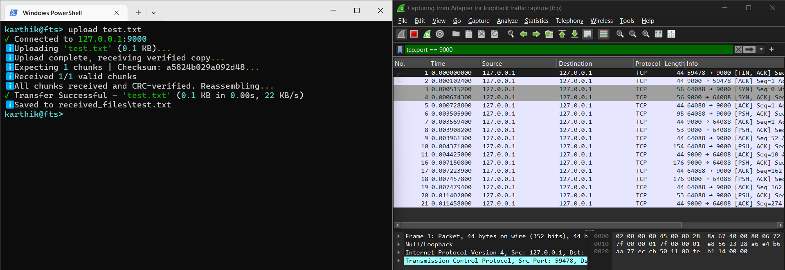
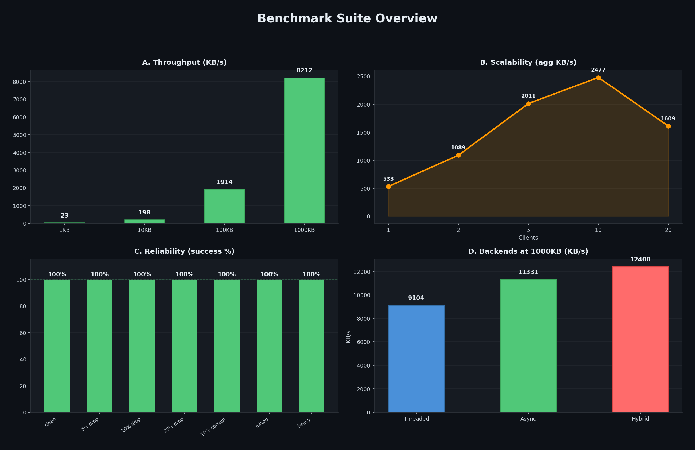
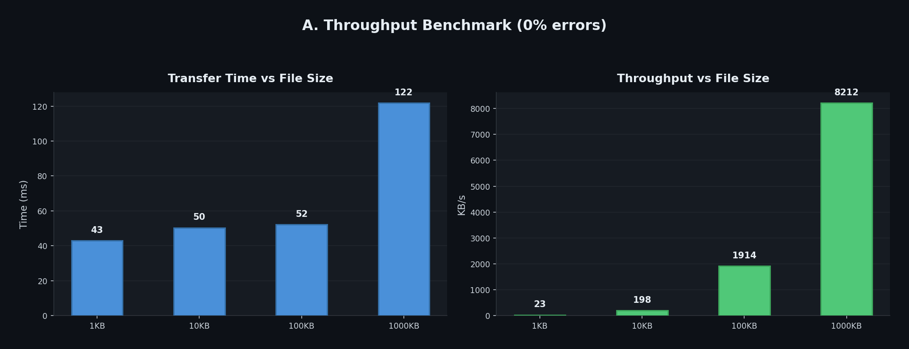
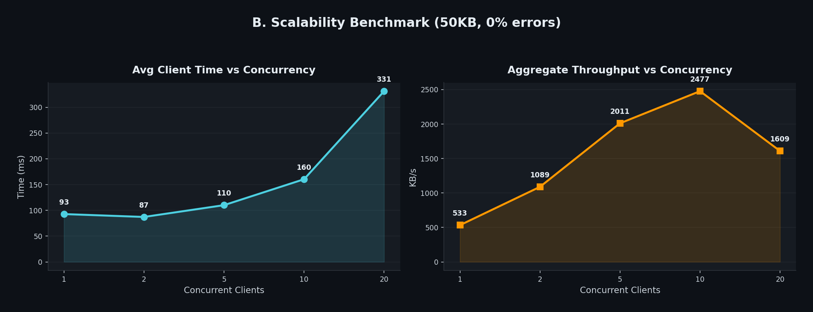
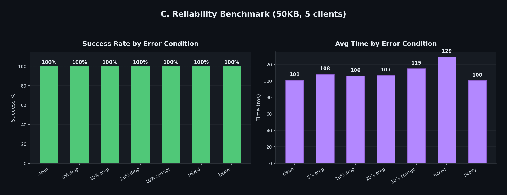
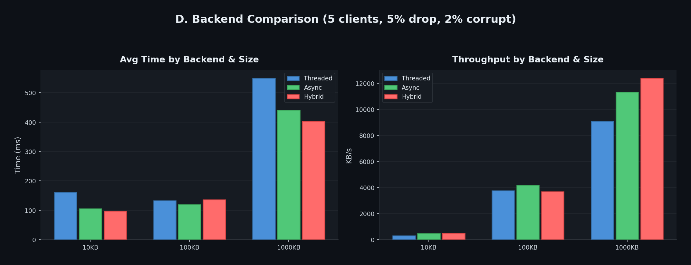

# Multi-Client File Transfer System

A TCP socket-based file transfer system with chunked transmission, dual-layer integrity verification (SHA-256 + per-chunk CRC32), out-of-order packet handling, corruption simulation with retransmission, LRU caching, session management, and three concurrent server backends.

**Challenge:** Challenge 2 — The Multi-Client Mayhem

## Quick Start

```bash
python launcher.py
```

One command. Starts the hybrid server (asyncio + threadpool) in the background and drops you into an interactive terminal. Type `help` for commands.

```bash
python launcher.py --threaded    # use threaded backend instead
```

## Architecture

```
┌─────────────────────────────────────────────────────────────────┐
│                        CLIENT TUI                               │
│  upload  download  ls  lc  IndexGet  FileHash  Cache  history   │
└─────────────────┬───────────────────────────────────────────────┘
                  │ TCP (persistent session)
┌─────────────────▼───────────────────────────────────────────────┐
│                        SERVER                                   │
│  ┌────────────────┐  ┌──────────────┐  ┌─────────────────────┐  │
│  │  Concurrency   │  │   File       │  │   LRU Cache         │  │
│  │  (thread/async │  │   Storage    │  │   (chunks+checksums)│  │
│  │  /hybrid)      │  │              │  │                     │  │
│  └────────────────┘  └──────────────┘  └─────────────────────┘  │
└─────────────────────────────────────────────────────────────────┘
```

**Wire Protocol:** 9-byte binary header (`msg_type:1 | seq_num:4 | payload_len:4`, big-endian) + variable payload. Packed with `struct` for efficiency, framed with length-prefix so the receiver always knows exactly how many bytes to read.

**Integrity:** Two-layer verification. Per-chunk CRC32 detects corruption on arrival (before reassembly). Full-file SHA-256 verifies end-to-end integrity after reassembly.

**Network Packet Capture:** TCP communication verified with Wireshark on loopback adapter.



## Commands

| Command | Description |
|---------|-------------|
| `upload <path>` | Upload a file to the server |
| `download <filename>` | Download a file from the server |
| `ls` | List files on the server |
| `lc` | List files in local directory |
| `IndexGet longlist [*.ext] [keyword]` | Detailed server file listing with optional filters |
| `IndexGet shortlist <start> <end> [*.ext]` | Files between timestamps |
| `FileHash checkall` | Hash all server files, compare with local copies |
| `FileHash verify <file>` | Hash a single file, compare with local |
| `Cache show` | Show session cache contents (3-slot LFU) |
| `Cache verify <file>` | Check cache, download if missing |
| `config [key value]` | View or change server config remotely |
| `history` | Show command history for this session |
| `status` | Show server status and cache stats |
| `benchmark [n] [size]` | Run transfer benchmarks |
| `stresstest [c] [kb] [d%] [c%]` | Concurrent stress test (auto-configures server) |
| `help` | Show all commands |
| `quit` | Exit |

## Server Backends

| Backend | File | Concurrency Model | Best For |
|---------|------|-------------------|----------|
| **Threaded** | `server.py` | `threading.Thread` per client | Simplicity, <10 clients |
| **Async** | `server_async.py` | `asyncio.start_server` with coroutines | High concurrency, small files |
| **Hybrid** (default) | `server_hybrid.py` | `asyncio` + `ThreadPoolExecutor` for CPU | Large files, mixed workloads |

## Benchmark Results

Full benchmark suite: `python benchmark_suite.py` then `python generate_chart.py`



### A. Throughput



| File Size | Transfer Time | Throughput |
|-----------|--------------|------------|
| 1 KB | 43 ms | 23 KB/s |
| 10 KB | 50 ms | 198 KB/s |
| 100 KB | 52 ms | 1,914 KB/s |
| 1000 KB | 122 ms | 8,212 KB/s |

Throughput scales 350x from 1KB to 1MB. Small files are dominated by protocol overhead (~43ms baseline), while large files achieve near-maximum transfer speed.

### B. Scalability



| Clients | Avg Time | Aggregate Throughput |
|---------|----------|---------------------|
| 1 | 93 ms | 533 KB/s |
| 2 | 87 ms | 1,089 KB/s |
| 5 | 110 ms | 2,011 KB/s |
| 10 | 160 ms | 2,477 KB/s |
| 20 | 331 ms | 1,609 KB/s |

Peak aggregate throughput at 10 clients (2,477 KB/s). Degradation at 20 clients is linear, not exponential — the server degrades gracefully under load rather than failing.

### C. Reliability



**100% success rate across all error conditions**, including 20% packet drops, 10% corruption, and combined "heavy" errors (20% drop + 10% corrupt + 5% duplicate). Retransmission overhead ranges from 101ms (clean) to 129ms (mixed errors).

### D. Backend Comparison (1000KB files, 5 clients)



| Backend | Throughput | vs Threaded |
|---------|-----------|-------------|
| Threaded | 9,104 KB/s | baseline |
| Async | 11,331 KB/s | +24% |
| Hybrid | 12,400 KB/s | +36% |

The hybrid advantage appears at larger file sizes where CPU work (SHA-256, file splitting) blocks the event loop. At 10KB files, async wins because executor dispatch overhead exceeds the hash computation time. This crossover behavior demonstrates that the optimal backend depends on the workload.

## Error Simulation

Five configurable network conditions, all controllable via `config` command:

| Condition | Config Key | Default | What it does |
|-----------|-----------|---------|-------------|
| Packet drops | `drop_rate` | 0.1 | Chunk never sent |
| Corruption | `corrupt_rate` | 0.05 | Bits flipped, CRC mismatch on client |
| Duplicates | `duplicate_rate` | 0.0 | Same chunk sent twice |
| Latency | `latency_ms` | 0 | Delay between chunks with ±50% jitter |
| Reordering | `shuffle_chunks` | True | Chunks sent in random order |

Detection and recovery: client verifies CRC32 per chunk on arrival. Missing chunks (drops) and corrupted chunks (CRC failures) are both collected and requested via `RETRANSMIT_REQ`. Server resends only the specific affected chunks. Loop repeats up to 10 rounds.

## Caching

**Server-side LRU cache** keyed by SHA-256 content hash. Repeated transfers of the same file skip re-reading and re-splitting. Thread-safe (`RLock`), TTL-based expiry (300s), configurable capacity (64 entries). Stats visible via `status` command.

**Client-side session cache** — 3-slot LFU (Least Frequently Used) cache per session. `Cache verify <file>` checks the cache first, downloads via TCP on miss, evicts the least-accessed file when full.

## Testing

```bash
pip install pytest
python -m pytest tests/test_transfer.py -v
```

**32 tests across 10 categories:**

| Category | Tests | What it proves |
|----------|-------|---------------|
| Core transfer | 4 | Text, binary, chunk boundary, 1-byte files work |
| Out-of-order | 1 | Shuffled chunks reassemble correctly |
| Retransmission | 1 | Recovery from 20% drops + 10% corruption |
| Concurrent clients | 1 | 5 simultaneous transfers succeed |
| Server-side cache | 4 | Hit/miss, LRU eviction, TTL expiry, thread safety |
| Server commands | 4 | List, status, upload-then-list, download nonexistent |
| Per-chunk CRC | 4 | CRC roundtrip, corruption detection, empty data, bit flips |
| Concurrency independence | 2 | 10-client file isolation + crash isolation |
| Boundary cases | 4 | Exact chunk, 1 byte over, all-zeros, all-0xFF |
| Integration (external checksum) | 2 | SHA-256 and MD5 computed independently of the system |
| Progressive stress | 2 | Drop rates 5→25%, client counts 2→10 |

## Setup

```bash
# Core — zero external dependencies
python launcher.py

# Optional: rich TUI (falls back to plain text without it)
pip install rich

# Optional: benchmarks and charts
pip install matplotlib
python benchmark_suite.py
python generate_chart.py

# Optional: run tests
pip install pytest
python -m pytest tests/ -v
```

## Project Structure

```
file-transfer/
├── launcher.py              # One-command startup (hybrid server + TUI)
├── protocol.py              # Wire protocol, CRC32, SHA-256, file splitting
├── cache.py                 # Thread-safe LRU cache with TTL
├── server.py                # Threaded server
├── server_async.py          # Async server (asyncio)
├── server_hybrid.py         # Hybrid server (asyncio + threadpool)
├── client.py                # Client with session management and TUI
├── benchmark.py             # Backend comparison (legacy)
├── benchmark_suite.py       # Full benchmark suite (4 categories)
├── generate_chart.py        # Chart generator for both benchmark formats
├── DESIGN.md                # Detailed design document
├── assets/
│   ├── bench_overview.png   # Combined 4-panel benchmark chart
│   ├── bench_throughput.png
│   ├── bench_scalability.png
│   ├── bench_reliability.png
│   ├── bench_backends.png
│   └── wireshark_capture.png
├── tests/
│   └── test_transfer.py     # 32 automated tests
├── sample_files/
│   ├── test.txt
│   └── binary_test.bin
├── .gitignore
└── README.md
```
